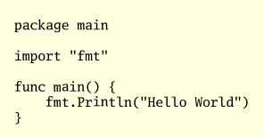
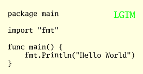

# Carver

Carver is a simple utility to render text over images or standalone in a PNG file. Of course there are already many good utilities to do that. The issue with them, is that they are highly configurable and is not straightforward to do the simple case: just the image and the text. I always forget how to use them and every time i read the manual or the cheatsheet. I wanted something simple and sweet.

## Installation

```
go get -u github.com/anastasop/carver
```

It should build the program and place it in `$GOPATH/bin`.

## Usage
```
carver --help
```

```
usage: carver -t <text> -i image.png -o out.png

Carver renders lines of text over a png or jpeg image.
  -a string
        Where to place text on a 3x3 grid. One of tl, tc, tr, cl, c, cr, bl, bc, br. (tl -> top left etc) (default "tl")
  -b string
        Background color NRGBA in 8 small hex digits. Ex 0a0b0cff. (default "ffffe0ff")
  -c string
        Foreground color NRGBA in 8 small hex digits. Ex 0a0b0cff. (default "000000ff")
  -d float
        dpi (default 96)
  -f string
        A TTF file. If empty use gomono https://blog.golang.org/go-fonts.
  -i string
        Input image file to use as canvas. If not given, render over the background color.
  -n    Don't render text but estimate and print the bounds.
  -o string
        Output image file.
  -p float
        Font size in points. (default 11)
  -t string
        Text to render. If empty, read stdin.
```

## Examples
You can use carver to render code to PNG
```
cat hello.go | carver -o hello.png
```
and you get



Then you can use carver to annotate it with a big green LGTM
```
carver -t LGTM -c 00ff00ff -p 14 -a tr -i hello.png -o hello2.png
```
and you get



## Bugs

- Maybe the text margin should not be fixed 16 pixels but analogous to the font size
- It is not easy to decide on a good default DPI

## License

Released under the [GPLv3](https://www.gnu.org/licenses/gpl-3.0.en.html).
